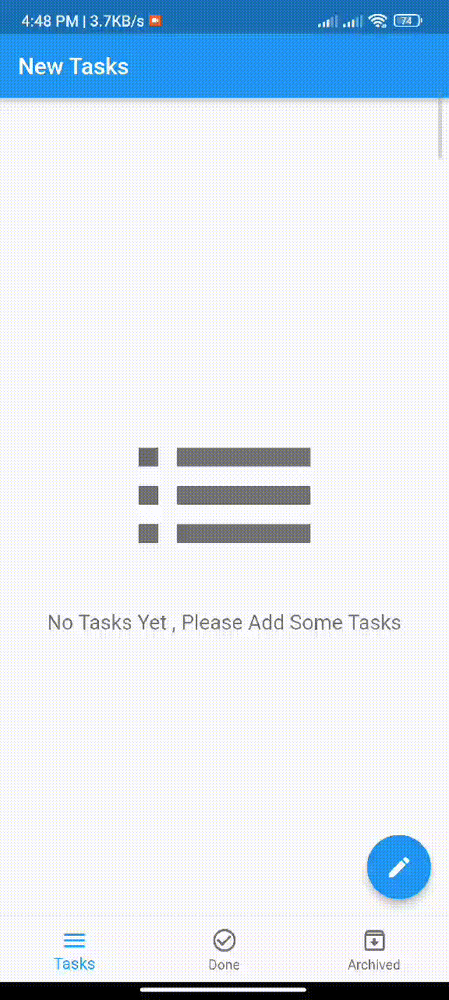

# To-Do List

This is an android development project built in flutter. I have tried to build a to-do list for managing to-do lists with SQLite as the local database and implement Bloc state management. Utilize the Bloc library to handle the app's business logic and UI state, while SQLite facilitates persistent storage for tasks. This architecture ensures a robust and scalable solution for organizing and persisting to-do items within the Flutter application.. 
To download this app, follow this link: [ToDoListApp](https://www.dropbox.com/scl/fi/kp8sq73ebiuua213qjeeb/ToDo-List.apk?rlkey=r58pr7sa46zxrxyjm8gyj460l&dl=0)

## Demo

Here is a demo of the project: 

  

## Delete Task

Here is a delete task in project:

  

## For users:

### Features: 
1. Can create task.
2. assign task Time and task Date . 
3. You can Archive task.
4. You can mark the task as Done.
5. Deleting task by swipe.

## For Developers

### Technologies used in this preoject: 
1. Platform: Flutter (version 3.0.0)
2. Programming Language: Dart(version 3.2.0)
3. Editor: Android Studio
4. Database: SQLite (have to be included as a dependency too)
5. State Management: Bloc(cubit)

### Widgets used: 
1. SafeArea (to make the app UI for different sizes of screen)
2. Scaffold (to have a general layout of the structure of the app)
3. AppBar (to display options, actions and current page)
4. Dismissible (The Dismissible widget in Flutter enables swipe-to-dismiss functionality for list or grid items.)
5. FloatingActionButton (to add item to a list)
6. Padding ( adds space around its child widget for better layout control.)
7. CircleAvatar ( creates a circular-shaped user profile image.)
8. Row ( arranges its children in a horizontal line, facilitating the creation of horizontal layouts.)
9. Column ( arranges its children vertically in a single column.)
10. Text (to display text)
11. Color (to set color of a perticular widget)
12. Expanded ( used to allocate additional space to a child widget within a parent widget, enabling flexible and proportional layout.)
13. Form (to validate the input in input fields and save them) 
14. SizedBox ( is used to create a box with specified width, height, or both, providing precise control over empty space in the layout.)
15. IconButton ( creates a clickable icon for triggering actions in a user interface.)
16. InputTextFormField (to display input fields)
17. ConditionalBuilder (simplifies conditional UI rendering by allowing dynamic widget creation based on specified conditions)
18. ListView.separated (creating a scrollable list with separators between items.)
19. BlocConsumer ( rebuild widgets in response to state changes in a BLoC)

## Flutter Documentation
Follow [this](https://flutter.dev/docs)  link.

## SQLite Documentation
Follow [this](https://www.sqlite.org/docs.html)  link.

## Bloc Documentation
Follow [this](https://bloclibrary.dev/)  link.

 

